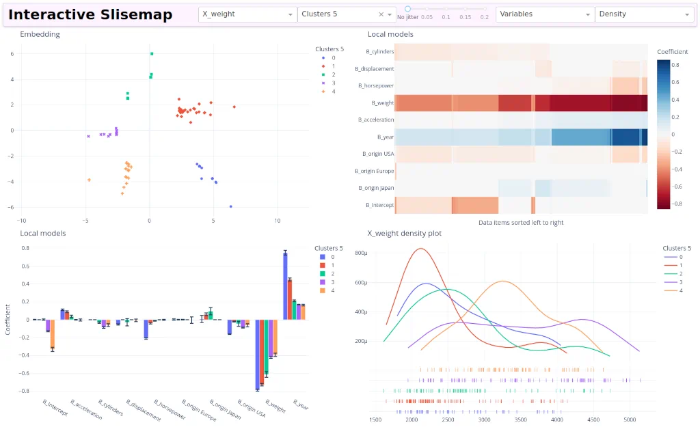

<!-- [](https://pypi.org/project/slisemap_interactive/) -->
[](https://github.com/edahelsinki/slisemap_interactive/actions/workflows/python-pytest.yml)
[](https://github.com/edahelsinki/slisemap_interactive/blob/master/LICENSE)
[](https://github.com/psf/black)
# [Slisemap](https://github.com/edahelsinki/slisemap)-interactive

Interactive plots for [Slisemap](https://github.com/edahelsinki/slisemap) using [Dash](https://dash.plotly.com/). This package can be used in four different ways:

1. __CLI:__ To start a standalone dash app just run `slisemap_interactive path/to/slisemap/object.sm` (if the package has been installed) or `python -m slisemap_interactive path/to/slisemap/object.sm` (in the root of this repository).

2. __REPL:__ To use it as (interactive) replacement plots for Slisemap from a Python terminal, import the *plot* function `from slisemap_interactive import plot` and use it `plot(slisemap_object)`.

3. __jupyter:__ To create plots in a jupyter notebook, import the *plot* function `from slisemap_interactive import plot` and use it `plot(slisemap_object)`.


4. __[χiplot](https://github.com/edahelsinki/xiplot):__ As a plugin that adds loading and plotting of Slisemap objects.
To use the plugin, just install the package in the same Python environment as [χiplot](https://github.com/edahelsinki/xiplot).

## Screenshots




## Installation

To install __slisemap_interactive__ without manually downloading the repository run:

```bash
pip install git+https://github.com/edahelsinki/slisemap_interactive
```

## Help

To see the syntax and arguments for the command line interface run:

```bash
slisemap_interactive --help
```

To see the arguments for the plot function use the `?` in IPython or Jupyter:

```python
from slisemap_interactive import plot
plot?
```

## Development

When developing __slisemap_interactive__ it is a good idea to do an “[editable](https://setuptools.pypa.io/en/latest/userguide/development_mode.html)” install.
An editable install just links “installed” Python files to the Python files in this directory (so that any changes are immediately available).
This takes care of the namespace resolution and also activates the "[entry_points](https://setuptools.pypa.io/en/latest/userguide/entry_point.html)" for the *standalone CLI* and *χiplot-plugin*.
To do an editable installation run:

```bash
pip install --editable ".[dev]"
```
